# Поэтапный план реализации MVP (с вашей проверкой после каждого этапа)

## Зафиксированный технологический стек
- Backend: `Python 3.12` + `FastAPI` + `SQLAlchemy 2` + `Alembic`
- DB: `PostgreSQL 16`
- Кэш и очередь: `Redis 7`
- Фоновые задачи: `Celery`
- Frontend (смартфон): `React + Vite + TypeScript` в формате `PWA`
- UI: `Tailwind CSS`
- Контейнеризация: `Docker` + `docker-compose` (dev с bind mount + live reload)
- Live reload:
  - backend: `uvicorn --reload`
  - frontend: `vite --host 0.0.0.0`
- Наблюдаемость: структурные логи + базовые метрики (`prometheus-fastapi-instrumentator`)

## Важный режим выполнения
- Работаем строго по этапам.
- После завершения каждого этапа я останавливаюсь, показываю результат и чек-лист проверки.
- Дальше двигаемся только после вашего явного подтверждения.

## Этап 1. Dev-окружение и базовый каркас backend+frontend

**Цель:** поднять локальную среду разработки в контейнерах, сразу с backend и frontend, чтобы приложение росло синхронно.

**Что делаем:**
- Создаем docker-конфигурацию для разработки:
  - `docker-compose.dev.yml` (backend + frontend + postgres + redis)
  - `backend/Dockerfile.dev`
  - `frontend/Dockerfile.dev`
  - `.dockerignore` (общий)
- Настраиваем bind mounts:
  - `./backend` монтируется в backend-контейнер
  - `./frontend` монтируется во frontend-контейнер
  - отдельные volumes для зависимостей
- Настраиваем live reload в контейнерах:
  - backend: `uvicorn --reload`
  - frontend: `vite --host 0.0.0.0`
- Настраиваем переменные окружения для dev:
  - `.env.example` + `.env.dev`
- Добавляем команды запуска:
  - `docker compose -f docker-compose.dev.yml up --build`
- Добавляем базовые health endpoints и стартовые страницы:
  - backend: `/health`
  - frontend: простая PWA-страница проверки API
- Добавляем краткую инструкцию в `doc/dev-setup.md`.

**Критерии готовности этапа:**
- Контейнеры поднимаются одной командой.
- Изменения в `backend` и `frontend` применяются без ручного рестарта.
- Frontend на смартфоне открывается по локальному IP в одной сети.
- Backend доступен с хоста, подключение к БД и Redis работает.

**Проверка вами перед переходом дальше:**
- Запуск без ошибок.
- Проверка live reload и в backend, и во frontend.
- Проверка доступа к PWA со смартфона.
- Проверка подключения backend -> postgres/redis.

## Этап 2. Аутентификация и роли (ранняя итерация)

**Цель:** с первых итераций включить безопасность и разграничение доступа для менеджера и курьера.

**Что делаем:**
- Backend:
  - сущности `User`, `Role`, `UserStoreAccess`, базовые миграции
  - JWT auth (access/refresh) и middleware авторизации
  - RBAC-проверки для manager/courier
- Frontend:
  - экраны входа/выхода и хранение сессии
  - route guards по ролям
  - базовый профиль пользователя
- Добавляем тестовые аккаунты менеджера и курьера для dev.

**Критерии готовности этапа:**
- Пользователь может войти и выйти из системы.
- Роль влияет на доступные разделы UI и endpoint-ы API.
- Неавторизованные запросы корректно получают `401/403`.

**Проверка вами:**
- Логин под менеджером и курьером.
- Проверка, что недоступные экраны и API закрыты по ролям.

## Этап 3. Вертикальный срез №1: слоты менеджера (backend + frontend)

**Цель:** на одном шаге отдать рабочий пользовательский сценарий менеджера с UI и API.

**Что делаем:**
- Backend:
  - миграции `Store`, `SlotTemplate`, `Slot`, `AuditEvent`
  - `POST /manager/slots/batch-create`
  - `PATCH /manager/slots/{slotId}`
  - `GET /manager/slots?storeId=&from=&to=`
  - валидации статусов + аудит
- Frontend:
  - экран менеджера: список/календарь слотов
  - форма массового создания
  - изменение статуса слота с отображением ошибок API

**Критерии готовности этапа:**
- Менеджер в UI может создать, увидеть и изменить слот.
- Все изменения пишутся в аудит.

**Проверка вами:**
- Создание и редактирование слотов через UI.
- Сверка с ответами API и аудитом.

## Этап 4. Вертикальный срез №2: бронирование курьера (backend + frontend)

**Цель:** добавить полный сценарий курьера с защитой от гонок и конфликтов.

**Что делаем:**
- Backend:
  - `GET /courier/slots?storeId=&date=`
  - `POST /courier/slots/{slotId}/book`
  - `POST /courier/bookings/{bookingId}/cancel`
  - `GET /courier/bookings/me`
  - транзакционное бронирование, идемпотентность и ошибки
  - правила MVP: отмена за 6 часов, разные магазины в день разрешены без пересечений
- Frontend:
  - экран курьера: доступные слоты и мои брони
  - кнопки брони/отмены с обработкой ошибок
  - фильтры по магазину и дате для мобильного сценария

**Критерии готовности этапа:**
- Нет двойного бронирования даже при гонках.
- Конфликт по времени детектируется стабильно.
- Курьер выполняет бронь и отмену из UI без ручных API-вызовов.

**Проверка вами:**
- Бронь и отмена через UI.
- Конкурентный тест двумя параллельными запросами на один слот.
- Проверка дедлайна отмены.

## Этап 5. In-app уведомления и наблюдаемость (backend + frontend)

**Цель:** базовая операционная прозрачность MVP.

**Что делаем:**
- Backend:
  - in-app уведомления при отмене/изменении слота менеджером
  - API выдачи уведомлений курьеру
  - метрики и структурные логи
- Frontend:
  - центр уведомлений/индикатор новых событий в PWA
  - отображение ключевых метрик менеджеру (минимальный dashboard)

**Критерии готовности этапа:**
- Уведомления формируются и доступны в API/хранилище.
- Метрики и логи позволяют понять состояние системы.
- Курьер видит уведомление в UI после действия менеджера.

**Проверка вами:**
- Имитировать отмену менеджером и проверить уведомление курьеру в UI.
- Проверить выдачу метрик и ключевые логи.

## Этап 6. UX-доработка мобильного PWA и стабилизация сценариев

**Цель:** закрыть пользовательский сценарий end-to-end.

**Что делаем:**
- Улучшаем мобильные сценарии:
  - крупные touch-controls, быстрые фильтры, статусы броней
  - PWA manifest, иконки, installability
- Backend дорабатывается под UX:
  - оптимизация ответов под мобильные экраны
  - пагинация/сортировка для списков
- Усиливаем обработку ошибок и retry в UI.

**Критерии готовности этапа:**
- Сквозной сценарий от создания слота до бронирования и отмены работает.
- Сценарий стабильно работает на смартфоне в PWA-режиме.

**Проверка вами:**
- E2E smoke: менеджер создал слот -> курьер забронировал -> менеджер отменил -> курьер получил in-app уведомление.

## Этап 7. Финализация и релизная готовность

**Что делаем:**
- Тесты (минимум: критичные интеграционные сценарии).
- Документация запуска/отладки в Docker.
- Проверка стабильности и устранение найденных дефектов.

**Проверка вами:**
- Финальный приемочный прогон по чек-листу MVP.

```mermaid
flowchart LR
  stage1[Stage1_DevShell] --> gate1[UserCheck1]
  gate1 --> stage2[Stage2_Auth]
  stage2 --> gate2[UserCheck2]
  gate2 --> stage3[Stage3_ManagerSlotsVslice]
  stage3 --> gate3[UserCheck3]
  gate3 --> stage4[Stage4_CourierBookingVslice]
  stage4 --> gate4[UserCheck4]
  gate4 --> stage5[Stage5_NotifyObservabilityVslice]
  stage5 --> gate5[UserCheck5]
  gate5 --> stage6[Stage6_PwaPolish]
  stage6 --> gate6[UserCheck6]
  gate6 --> stage7[Stage7_Finalize]
```

