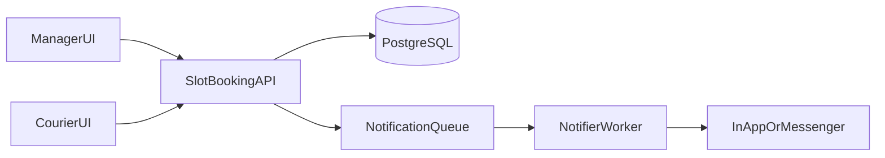

# План системы бронирования слотов курьеров

## 1) Цель MVP

Сделать внутреннюю систему, где менеджер создаёт фиксированные временные слоты, а курьеры самостоятельно бронируют свободные слоты для работы. Покупатель в процессе не участвует.

Критерии успеха MVP:

- Курьер видит доступные слоты по магазину и дате.
- Один слот не может быть занят двумя курьерами одновременно.
- Менеджер может управлять слотами (создать, закрыть, отменить, переназначить).
- Есть базовая история изменений и уведомления об изменениях слота.

## 2) Роли и права

- **Менеджер магазина**: создаёт/редактирует/закрывает слоты, подтверждает или снимает брони, видит загрузку.
- **Курьер**: просматривает доступные слоты, бронирует, отменяет свою бронь в рамках правил.
- **Админ (опционально для MVP-lite)**: управление справочниками и доступами между магазинами.

## 3) Доменная модель

Основные сущности:

- `Store` — магазин.
- `Courier` — курьер (статус, привязка к магазинам, активность).
- `SlotTemplate` — шаблон фиксированного окна (например, 10:00–12:00).
- `Slot` — конкретное окно на дату и магазин (`OPEN`, `BOOKED`, `CLOSED`, `CANCELLED`).
- `SlotBooking` — запись факта бронирования (кто, когда, источник, причина отмены).
- `AuditEvent` — журнал действий по слоту/броням.

Ключевые ограничения:

- Уникальность активной брони на слот: `one active booking per slot`.
- Один курьер не может занять пересекающиеся слоты по времени.
- Ограничение по горизонту бронирования (например, не дальше 14 дней).

## 4) Бизнес-правила (первая версия)

- Менеджер создаёт слоты пакетно на день/неделю.
- Курьер бронирует только слоты в доступных ему магазинах.
- Отмена курьером разрешена до дедлайна (например, за N часов до начала).
- После дедлайна слот снимается только менеджером.
- Если слот отменён менеджером, курьер получает уведомление.
- Перебронирование в конфликтный интервал запрещено на уровне API и БД.

## 5) Архитектура (MVP)

- **Backend API**: сервис слотов и бронирований, транзакционная логика конкуренции.
- **DB (PostgreSQL)**: хранение слотов, бронирований, аудита.
- **Async notifications**: очередь/воркер для push/чат/SMS (можно начать с in-app уведомлений).
- **Frontend**:
  - Интерфейс менеджера (календарь слотов, массовое создание, контроль статусов).
  - Интерфейс курьера (список/календарь свободных слотов, мои брони).

## 6) API-контуры

Минимальный набор endpoints:

- `POST /manager/slots/batch-create`
- `PATCH /manager/slots/{slotId}`
- `POST /courier/slots/{slotId}/book`
- `POST /courier/bookings/{bookingId}/cancel`
- `GET /courier/slots?storeId=&date=`
- `GET /courier/bookings/me`
- `GET /manager/slots?storeId=&from=&to=`
- `GET /manager/metrics/slot-utilization`

Требования к `book`:

- Транзакция + блокировка записи слота (`SELECT ... FOR UPDATE`) или эквивалентный optimistic locking.
- Идемпотентность запроса (idempotency key).
- Явные коды ошибок: `SLOT_ALREADY_BOOKED`, `SLOT_CONFLICT`, `BOOKING_DEADLINE_PASSED`.

## 7) Наблюдаемость и надёжность

- Логировать все изменения статуса слота и брони.
- Метрики: fill-rate слотов, процент отмен, late-cancel, число конфликтных попыток бронирования.
- Алерты: резкий рост конфликтов/ошибок бронирования.

## 8) План релизов

### Этап 1 (MVP, 2–4 недели)

- Сущности, CRUD слотов для менеджера, бронирование курьером, отмены, базовые уведомления.

### Этап 2

- Массовые операции, шаблоны смен, ограничения по нагрузке курьера, отчёты.

### Этап 3

- Автоподсказки оптимальных слотов, прогноз недобора, интеграции с трекингом доставок.

## 9) Риски и как закрыть

- **Race condition при одновременном бронировании** → строгая транзакционная логика + уникальные индексы.
- **Низкая дисциплина отмен** → дедлайны и санкционные правила.
- **Слабое принятие курьерами** → простой UX: 2 клика до брони, понятные статусы и напоминания.

## 10) Что уточнить перед реализацией

- Политика дедлайнов отмен и штрафов.
- Нужно ли бронирование на несколько магазинов в один день.
- Канал уведомлений в MVP: только in-app или сразу мессенджер/SMS.

